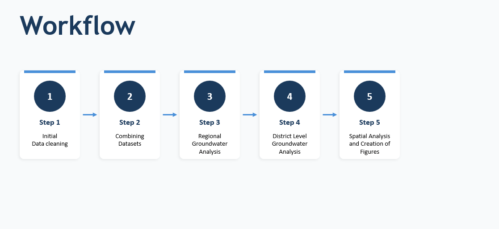
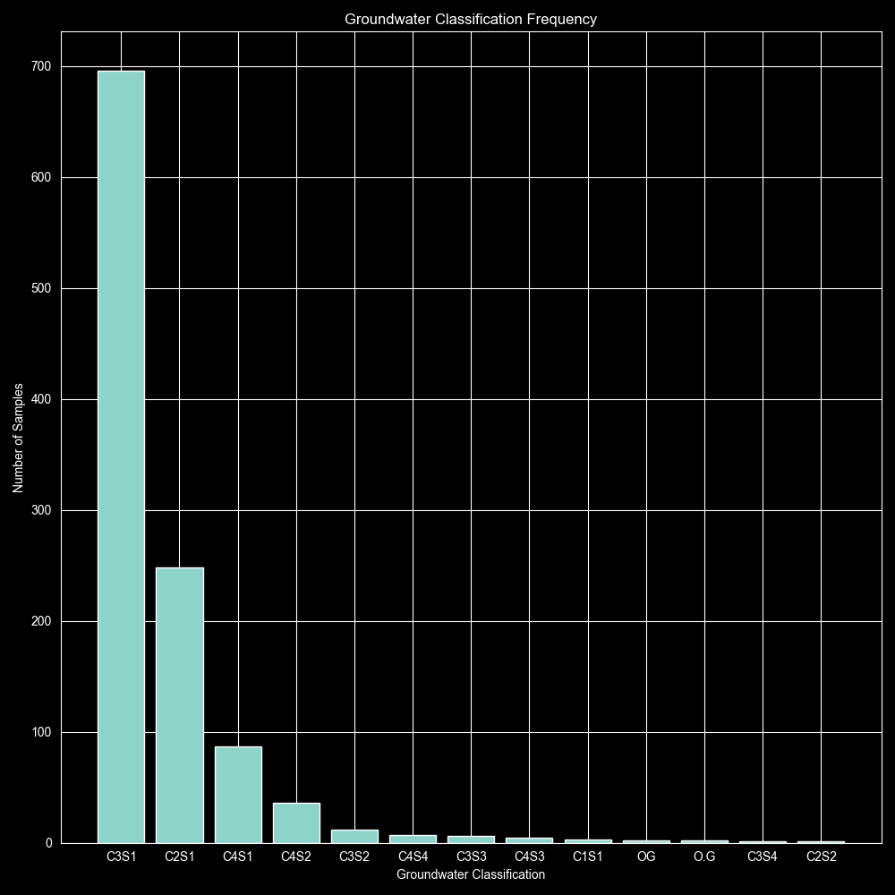
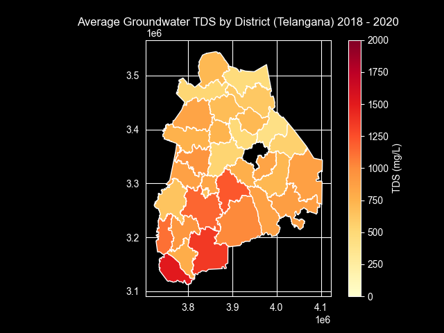
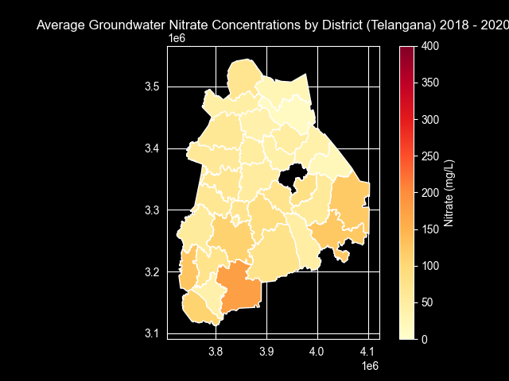
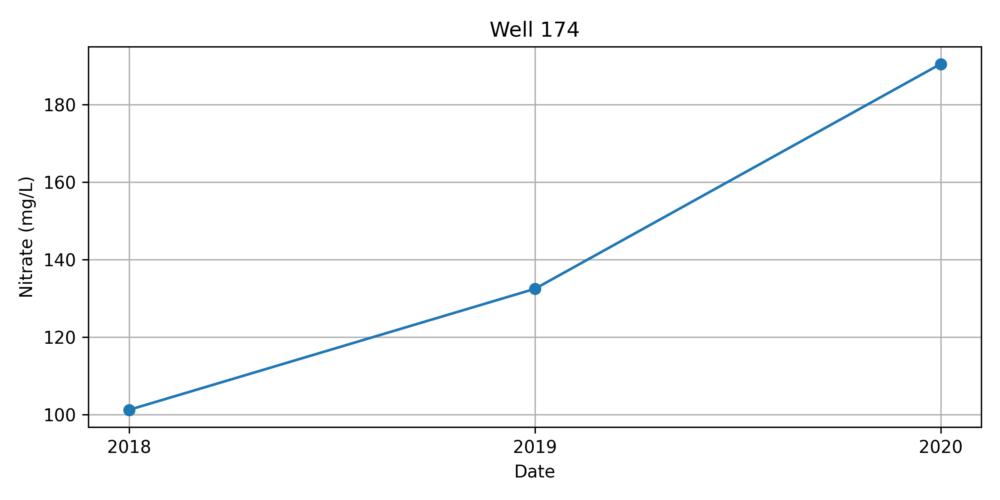
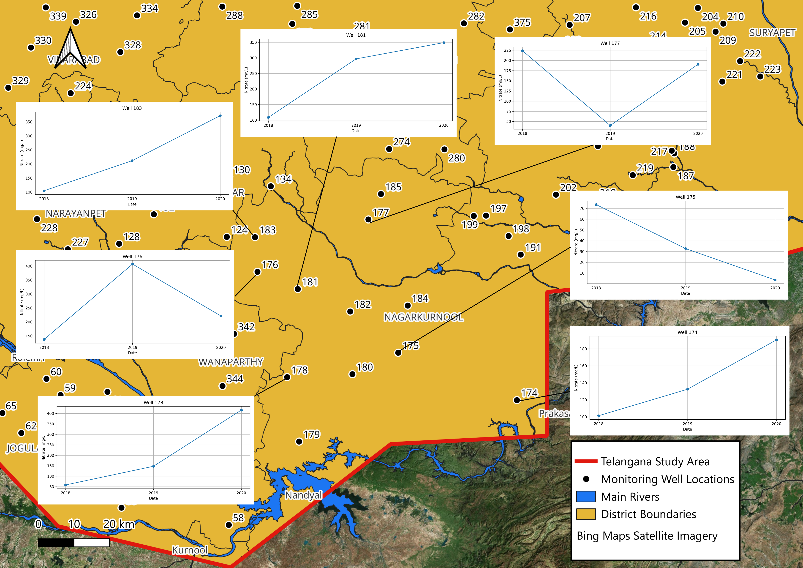
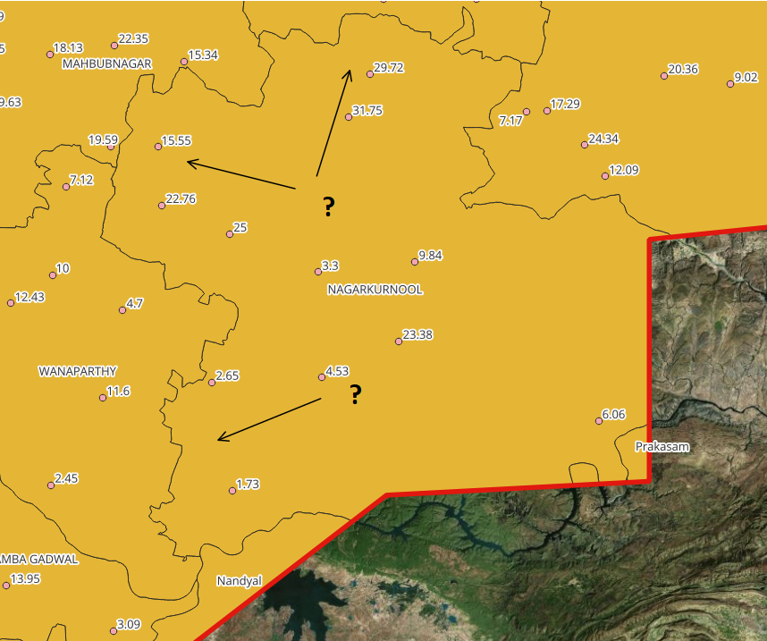

Telangana Groundwater Quality Analysis
====================================================

Project Scope:
Analyse groundwater quality datasets (2018 - 2020) from the Telangana district in India, to identify regions of the poorest groundwater
quality. The focus of the project is to showcase programming skills in conjunction with existing spatial and 
visualisation techniques and domain knowledge and use of AI tools to help refactor code into a reproducible output, however is not to present a thorough hydrochemical/hydrogeological 
assessment. 

Study area:

Data Sources:
Telangana water quality dataset:
https://www.kaggle.com/datasets/sivapriyagarladinne/telangana-post-monsoon-ground-water-quality-data

Telangana administrative boundaries:
https://onlinemaps.surveyofindia.gov.in/Digital_Products.aspx?id=aUJENBZyfoy92ggfHhqVHQ

India main rivers shapefiles:
https://yashveeeeeeer.github.io/india-geodata/

Technologies:
-	Python        
-	Pandas     
-	GeoPandas
-	Matplotlib
-  QGIS 

Workflow:

## Step 1: Initial Data load and Cleaning
___
_see cleaning.py_

The first step was to import the required libraries for the project, and then load the 3 datasets using
pandas. 
A quick inspection of the column names from the 3 datasets found many inconsistencies with the 
nomenclature used, and therefore work was done to homogenize the column names. 

## Step 2: Concatenating Datasets

Once the dataset column names had been homogenized, the next step was to combine the 3 datasets into a 
single dataset and check for null values.

Groundwater had already been classified at every monitoring point across Telangana (C1S1 - C4S4), which 
was predominantly based on salinity-related parameters (an assessment for agricultural suitability, as opposed to drinking water standards).
A quick chart was made of the frequency of these classifications.

## Step 3 Regional Groundwater Analysis

The next step, was to create a geodataframe using geopandas. Columns representing analytes of interest were selected
from the combined dataset, and were converted to numeric data. The mean values for every analyte of interest
for every district within Telangana was calculated and saved as a dataframe (district_summary).

The 33 Telangana Administrative District boundary polygons were downloaded, and loaded within pycharm as a 
geodataframe (districts).

Following that, a comparison was made between the district names of the district boundary polygon and district summary dataframes,
to check for inconsistencies.
Many inconsistencies with the nomenclature of the district names were identified, and subsequent edits were made.
The district boundary summary dataframe and the district boundary polygon dataframe were then merged.

The mean TDS (mg/L) per district was then plotted. The data was also presented using a barplot (not shown).

The process was then repeated for Nitrate, and the distribution plotted.

n.b. for the sake of time, no other analytes were analysed however this process could quickly be repeated 
for all analytes of interest. The choropleth mapping was just used as an exercise to demonstrate existing skills, and 
at a very high-level allude to where contamination was prevalent. 

Based on the two analytes plotted, the region of Nagarkurnool was selected 
for a district level analysis. 

## Step 4 District Level (Nagarkurnool) Groundwater Analysis

A geodataframe was created of the chosen district for analysis
(Nagarkurnool), and TDS and nitrate concentrations were plotted. 

The next phase of the analysis was to plot the nitrate time-series data
from 2018 - 2020. This meant that a 'year' column first had to be extracted
from the combined dataset, and then appended to it. 

The SNO (serial number), represents the localities of all the monitoring 
locations within the dataset. The SNO were extracted just for locations
within Nagarkurnool, and saved to a list to be utilised when plotting the time
series data. 

A for loop was used to iterate through the list of monitoring wells within the district 
in order to plot the time series data (far quicker than plotting in excel!)

## Step 5 Spatial Analysis and Creation of figures

The exported analyte graphs were then loaded into the project QGIS map layout,
and added to the map at the corresponding localities. An alternative approach
could have been to use a html pop out of the graphs if viewing the map online.

For reference, WHO Drinking Water Standards for Nitrate is 50 mg/L.
Our dataset shows paramount examples of Nitrate contamination. Exceedances were 
recorded in almost every location in Nagarkurnool at least once within the dataset. 

Fluoride would be another key contaminant for analysis in further study.

The groundwater level data for 2018 was also plotted (see below), however it 
is evident there were inconsitencies in the data collection/quality,
which made it difficult to infer groundwater flow direction. 

## Recommended further analysis

1. Production of groundwater contour plots to ascertain regional and district 
level groundwater flow direction
2. Graphing of all major analytes (including fluoride and TDS etc.), using a
a similar technique to Step 5.
3. Comparison of analytes to drinking water standards and production of piper diagrams.

4a. Desk-based hydrogeological study to assign/develop hydrogeological CSM
for the region/ identify key hydrogeological units.

4b. Reclassification of groundwater bodies based on hydrochemical analysis.

5. Use of machine learning methods to:
   a. Reclassify groundwater bodies
   b. Contamination risk mapping
